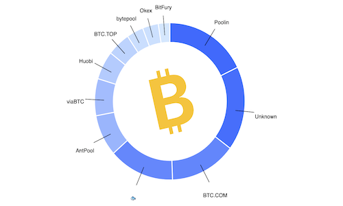

# Bitcoin Electricity Consumption - Data Visualization



## About the project

Bitcoin is a crypto-currency often criticized for its viability. Why ? The energy chasm it represents.
Mining bitcoin requires a great computing power, meaning a proportional amount of energy.

This visualization aims to give information about the energetic viability of Bitcoin : its origins, its evolution, comparision elements. It is therefore aimed at anyone interested in cryptocurrencies and the ecological impact.

This project was developed during a Data Visualization course and the details are available [on this page](https://lyondataviz.github.io/teaching/lyon1-m2/2019/projets.html).

Documents explaining the project evolution are available in the [Wiki section](https://github.com/pierrejonin/bitcoin_consumption/wiki).

## Visualization

The visualization is up and running at https://pierrejonin.github.io/bitcoin_consumption/.

## Build with 
* [D3.js](https://d3js.org/)
* [VueJS](https://vuejs.org/)
* [NodeJS](https://nodejs.org/en/)
* [CSS](https://developer.mozilla.org/fr/docs/Web/CSS)
* [HTML](https://developer.mozilla.org/fr/docs/Web/HTML)

## Architecture 
* **/doc** : Project documentation
* **/data** : data files
* **/pictures** : First sketches of the project
* **/dataviz/src** : Component files for the web visualization

## Run it locally

In the *dataviz* folder :     

```
npm install 
npm install -g serve
```   
Run the local server :  
```
npm run serve
```  

Compile : 
```
npm run build
```
